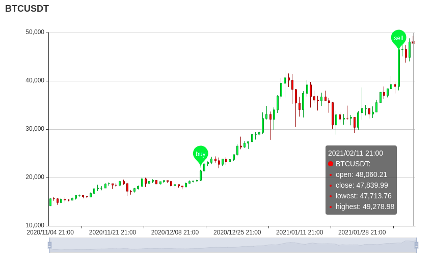

# Go Candlestick Charts

- Live data retrieved from Binance Futures API with help of [crex](https://github.com/coinrust/crex)
- Chart created with [go-echarts](https://github.com/go-echarts/go-echarts)

[](./BTCUSDT_12.02.2021.png)

To run:

```bash
go run main.go
```

Server will be running on http://localhost:7777